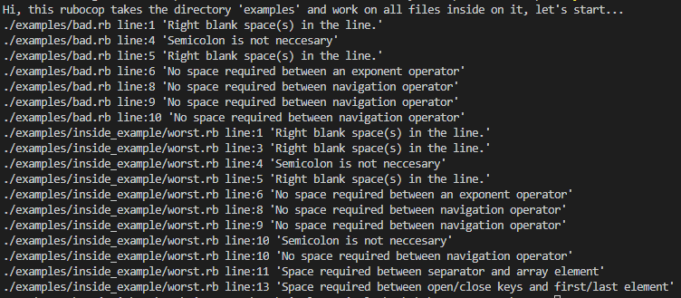

# Rubocop linters

> A rubocop version made by myself for ruby language. This tool helps to get the rubocop issues in a script.



**This project was build with ruby 2.7.2p137 (2020-10-01 revision 5445e04352) [x64-mingw32]**

## Built With

- Ruby
- Rubocop
- Rspec

## Set up locally

- Clone the repository.
- Make sure that you install ruby, open the CMD and type "ruby -v". If you can't see the version install ruby [here!](https://rubyinstaller.org/).
- Make sure to have rspec in your computer after ruby, if you don't have rspec, you can install it opening your terminal and typing "gem install rspec". Use "rspec --version" to check if the installation was completed.
- Open the folder in a terminal and run the main file with "ruby bin/main.rb".
- Check the rspec test using "rspec" in the terminal.

## Rules

> As a style checker, this tool helps in specific ways to have your code according to good practices in ruby language. Here you can see some examples who explain rules and to know what exactly mark this tool when you run it.

== Right spaces

Is not good to have right *blank-space(s)* in a line after logic.

```Ruby
# bad - blank-spaces after code
def some_method&nbsp;&nbsp;&nbsp;&nbsp;
  #Code here...
end

# good
def some_method
  #Code here...
end
```

== Blank line at the start

Consider blank lines at the script start.

# bad - a blank line

def some_method
  #Code here...
end

# good
def some_method
  #Code here...
end

== Semicolon

A Semicolon after the line is not required.

# bad - using a semicolon
puts "I'm a puts";

# good
puts "I'm a puts"

== Navigation operator

When a navigation operator is used, is not required to have blank spaces between the operator and the elements.

# bad
foo &. bar
foo &.bar
foo&. bar

# good
foo&.bar

== Space between elements in Array

The array should have a blank space between the open key with the first element, between the comma with next element, and before the close key.

# bad
[ 1,2, 3 ]
[1, 2, 3]

# good
[ 1, 2, 3 ]

== Space between exponent operator is not required

The exponent operator symbol and the elements should be together.

# bad
e  = M * c ** 2

# good
e = M * c**2

## Authors

👤 **Victor Pacheco**

- GitHub: [@vichuge](https://github.com/vichuge)
- LinkedIn: [LinkedIn](https://www.linkedin.com/in/victor-pacheco-7946aab2/)

## 🤝 Contributing

Contributions, issues, and feature requests are welcome!

Feel free to check the [issues page](https://github.com/vichuge/rb-capstone-rubocop/issues).

## Show your support

Give an ⭐️ if you like this project!

## 📝 License

This project is [MIT](https://github.com/vichuge/rb-capstone-rubocop/blob/rubocop-logic/LICENSE) licensed, thanks.
